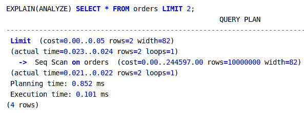

# Оператор EXPLAIN в PostgreSQL

## Вступление

Сегодня мы поговорим об операторе **EXPLAIN** и СУБД **PostgreSQL**.

Сегодня мы поговорим о том:

* Как найти запрос, который "тормозит" (вскользь);
* Как PostgreSQL обрабатывает запрос;
* Как PostgreSQL оптимизурует время выполнения запроса;
* Какие подсказки даёт нам PostgreSQL и как ими воспользоваться;

### Проблема

Наверное всем знакома ситуация, когда запрос к базе данных выполняется немного (или много) дольше, чем планировалось.

Так как многие из нас работают с сайтами, мы понимаем, что генерация одной страницы очень редко обходится одним запросом. Это могут быть десятки, а то и более, запросов. Некоторые запросы могут выполняться параллельно, некоторые - нет, т.к. требуют данных других запросов.

Вот простой пример. Если один запрос выполняется 200ms, то два таких запроса - уже 400ms, а это почти пол секунды! Кто захочет ждать столько времени, пока страница сайта подгрузится? В такой ситуации многие поситители просто воспользуются другим ресурсом, который будет доставлять им меньше неудобств.

Конечно, скажете вы, можно использовать кэш и не выполнять все запросы в базу напрямую.

Однако тут есть проблемы:

* Любой кэш сначала нужно "прогреть";
* Кэш хорошо бы вовремя инвалидировать, а не хранить на стороне Nginx по 10 и более минут;
* Даже если кэш "прогревать" на стороне backend'а, всегда может встретиться редкий запрос, который не учли;
* Есть запросы, которые попросту нельзя кэшировать (не всё же в мире сводится к новостным сайтам, да и новостные сайты не все примитивны);
* И много-много других ситуаций, когда запрос нужно выполнить напрямую;

В общем, даже если кто-то говорит, что кэш - это выход, я с этим категорически не согласен. Надеюсь, что теперь вы понимаете почему.

## Поиск медленных запросов

Говоря про медленные запросы, очень сложно обойти совсем и не упомянуть хотя бы вскользь средства для поиска этих запросов, которые предоставляет нам PostgreSQL.

Когда что-то где-то идёт не так, никогда не знаешь в чём же заключается проблема, пока не проделаешь некоторую аналитическую работу.

Вот 3 инструмента, перечисленных на официальном сайте PostgreSQL в статье [Logging Difficult Queries](https://wiki.postgresql.org/wiki/Logging_Difficult_Queries):

* Встроенный лог медленных запросов;
* Модуль `pg_stat_statements`;
* Модуль `auto_explain`;

### Лог медленных запросов

Для того, чтобы получить базовую фунциональность, необходимо изменить 3  параметра в конфигурационном файле **posgresql.conf**:

* `log_min_duration_statement = 100` (по-умолчанию: -1). Обязательно чтобы логгировать запросы, выполнение которых занимает > 100ms;
* `logging_collector = on` (по-умолчанию: ‘off’). Обязательно: чтобы отправлять сообщения в лог файл;
* `log_statement = ‘mod’` (по-умолчанию: ‘none’). Если нужно логгировать statement, для запросов с модификацией данных;

После этого все медленно выполняющиеся запросы будут логгироваться в файл.

Ниже инструкция для тех, кто не знает, где что искать.

1. Чтобы найти конфигурационный файл _posgresql.conf_ PostgreSQL, можно выполнить команду `show config_file` в оболочке `psql`.
2. Чтобы найти директорию с файлами логов, нужно выполнить 2 комманды (со стандартным конфигом):   
`show data directory`, чтобы найти директорию с данными PostgreSQL и `show log directory`, чтобы найти директорию с логами в ней. По-умолчанию,  это директория `pg_log`, которая лежит на одном уросне с файлом _postgresql.conf_.

### Модуль `pg_stat_statements`

Модуль `pg_stat_statements` предоставляет расширенную информацию по запросам.

Чтобы включить и настроить можно в postgres.conf добавить следующие параметры(пример из документации PostgreSQL):

* `shared_preload_libraries = pg_stat_statements` (по-умолчанию: ‘’). Добавить расширение в список подключаемых модулей;
* `pg_stat_statements.max = 10000` (по-умолчанию: 5000). Количество операций, которые хранятся модулем;
* `pg_stat_statements.track = all` (по-умолчанию: top). Какие операторы необходимо логгировать;

Вот пример запроса из документации PostgreSQL. Здесь мы видим, что работать с модулем `pg_stat_statements` нужно спомощью запросов в системный view.

Модуль `pg_stat_statements`:

* Позволяет аггрегировать и сортировать запросы по разным параметрам;
* А также, "умеет" объединять семантически одинаковые запросы;
* Считает количество вызовов;

### Модуль `auto_explain`

Добавляет вывод оператора EXPLAIN в лог долгих запросов, чтобы диагностировать проблему, не предпринимая никаких дополнительных действий.

Пример типичной конфигурации:

* `shared_preload_libraries = 'auto_explain'` (по-умолчанию: ‘’). Добавить расширение в список подключаемых модулей;
* `custom_variable_classes = 'auto_explain'` (по-умолчанию: ‘’). Разрешает установку собственных переменных расширениям;
* `auto_explain.log_min_duration = '3s'` (по-умолчанию: -1). Устанавливает минимальное время выполнения запроса для попадания его в auto explain log;
* `auto_explain.log_nested_statements = on` (по-умолчанию: off). Включает логгирование вложенных запросов (в функциях);

### Как PostgreSQL обрабатывает запрос?

Для того, чтобы понимать, что такое `EXPLAIN` и откуда берутся данные, с которыми он работает, предлагаю сначала посмотреть на то как, PostgreSQL обрабатывает запрос.

PostgreSQL имеет сложную многомодульную архитекрутру. Каждый модуль имеет свою зону ответственности: клиентские сессии, хранение данных, управление процессами и д.р.

Рассмортим систему PostgreSQL, которая отвечает за обработку входящего запроса.
В обработке запроса участвуют такие важные компоненты, как: Parser, Traffic Cop, Rewriter, Planner, Executor.

#### Parser

Этап разбора запроса начинается с получения SQL кода в виде последовательности ASCII символов.

Сначала **лексер** производит в коде поиск по шаблону: находит операторы и другие ключевый слова и создаёт из них **последовательность токенов**.

Эти токены потом поступают в **парсер**, который собирает из них дерево **синтактического анализа**.

Парсер проверяет, чтобы запрос соответствовал синтаксическим правилам SQL, однако семантика запроса ему не понятна. Если ошибка синтаксиса была найдена, обработка запроса сразу прерывается, а клиент получает соответствующую нотификацию. Если этого не произошло, запрос передаётся на следующую ступень: Rewriter.

#### Traffic Cop

**Traffic Cop** отвечает за то, чтобы отличать сложные части запроса от простых, фильтруя траффик между Parser’ом и Rewriter’ом.

Например, команды, определяющие транзакции: BEGIN и ROLLBACK, довольно просты и не нуждаются в дополнительной обработке. Другие команды, такие как SELECT и JOIN отправляются в Rewriter.

Такое разграничение уменьшает время обработки запроса, отдавая на оптимизацию только то, что действительно того стоит.

#### Rewriter

 
Этот этап заключается в **переписывании дерева разбора**, поступившего из парсера, с целью его оптимизировать. Это влечёт разбивание запроса на подзапросы.

#### Planner/Optimizer

Следующий этап – отределить, какой путь выполнения запроса наименее сложный.

Запросы SQL могут быть выполнены большим количеством способов, давая при этом одинаковый результат. Все эти варианты представленны в дереве разбора, которое было собрано парсером. Многие ключевые сова и операторы коммутативны, что позволяет использовать множество разных путей обхода дерева.

Тут оптимизатор пытается приблизительно понять: насколько велико количество вариаций обхода. Далее есть 2 варианта развития событий:

1.  Если оно не привышает некоторого порогового значения, то будут собраны все возможные пути обхода, сравнены и выбран наиболее оптимальный.
2. Если же значение, на вскидку, оказалось больше, PostgreSQL будет использовать встроенные алгоритмы поиска оптимального пути, которые дают более приблизительный вариант по сравнению с первым способом.

После этого, Planner имеет на руках план запроса, который был выбран лучшим и может быть передан Executor'у.

#### Executor

Получив план, Executor “достаёт” из таблиц необходимые данные.

Он рекурсивно спускается по плану, выполняя на каждой ступени необходимые действия. Если информация подзапроса необходима на текущем этапе, Executor идёт ниже, в противном случае действие может быть вополненно немедленно.

Данные отдаются последовательно, если это возможно, не дожидаясь полного вывода.

### Как планирует Planner?

PostgreSQL имеет системный таблицы с некоторой статистической информацией о данных в базе, которые подкодавливаются ещё одной подсистемой: _Statistics Collector_.

Это такие таблицы и view, как, например, `pg_statistics` и `pg_class`, откуда можно получить информацию о:

* Ширине всех столбцов таблиц;
* Количестве строк и страниц в таблице;
* etc.

При помощи данных собранных коллектором, а также некоторых конфигурационных параметров из файла `postgresql.conf` (например, `seq_page_cost`), PostgreSQL может делать предположение о том, сколько и как тот или иной запрос выполнится.

## Тестовые данные

Для начала. Для того, чтобы начать работать с запросами, нам понадобятся некоторые тестовые данные.
Давайте попробуем создать самую примитивную структуру самого простого интернет магазина с большим количеством записей в БД.

Создадим пустую тестовую БД. Я свою назову "example":

Теперь создадим внутри таблицы с данными.

**Таблица покупателей (customers)** состоит из 20 тыс. строк:

**Таблица товаров (products)** состоит из 100 тыс. строк:

**Таблица заказов (orders)** состоит из 10 млн. строк. Это таблица связей между покупателями и заказами:

## Средства анализа запроса

### Оператор EXPLAIN

И так. Предположим, нам удалось найти "тормозящий" запрос.
Чтобы понять причину, необходимо запрос "продебажить". Для этого и нужен **EXPLAIN**.

Посмотрим, что он нам может рассказать для очень простой операции выборки:

Какую информацию предоставил нам EXPLAIN:

Первая строка и все строки, начинающиеся с символа “→” обозначают операции. В данном случае – это одна простая операция Seq Scan;
Давайте разберём подробнее значения в скобках:

1. `cost = 0.00` – цена получения первой строки;
2. `..387.00` – цена получения последней строки (всех строк);
3. `rows=20000` – оценочное количество строк;
4. `width=42` – приблизительная средняя ширина строки;

**Цена строки (page cost)** – это не просто время выполнения, а некоторо композитное значение, учитывающее в себе и время, и сложность получения страницы.

Оно сравнивается с эталонным значением `seq_page_cost`, которое задаётся в _postgresql.conf_ и по-умолчанию равно единице.
Там же можно найти ещё несколько параметров, заканчивающихся на `_cost`. Они определяют то, как PostgreSQL будет считать цену запроса.

### Оператор ANALYZE

Давайте добавим в таблицу customers нового покупателя.

Посмотрим, что вернёт команда EXPLAIN:

Как мы видим, информация не изменилась: покупателей прежнее количество. Это происходит по той причине, что PostgreSQL опирается в своих рассчётах на некоторые статистические данные, которые обновляются при некотором условии (при изменении некоторого большого количества данных).

Настало время познакомиться с работой команды **ANALYZE**:

Вывод немного обновился! Произошло это потому, что команда ANALYZE собрала данные по текущей БД и обновила информацию, которой пользуется  планировщик.

Более того, EXPLAIN сам по себе вообще не выполняет запрос на самом деле. Он лишь приблизительно "прикидывает": как и сколько запрос будет выполняться.

### EXPLAIN(ANALYZE)

Если оператору EXPLAIN передать аргумент ANALYZE, запрос отработает в реальном времени, и информации по нему будет несколько больше:

Как мы видим, здесь добавилась ещё кое-какая информация (во вторых скобках):

* Реальное время запроса;
* Реальное количество строк;
* Количество циклов;

А также появились:

* **Planning time**: Время работы планировщика;
* **Execution time**: Время выполнения всех операций внизу;

### Кэш запроса

Для начала, необходимо сбросить кэш. Для полной его очистки выключим PostgreSQL, и обнулим системный кэш:

Теперь выполним наш запрос, дополнив EXPLAIN новым аргументом **BUFFERS**:

Тут мы видим новую информацию: чтение буфферов без кэша PostgreSQL: **Buffers: shared read = 187**;

Мы только что весь кэш обнулили, поэтому из него не читается ничего.
Что ж. Мы только что его “прогрели”. Теперь можно попробовать ещё раз:

Но что это? Всего 2 хита в кэш. Давайте разберёмся, почему это так происходит.

Дело в том, что PostgreSQL использует алгоритм **Ring Buffer Optimization** для того, чтобы экономить доступное место и справедливо распределять его между разными запросами. Чем чаще будет выполнсять запрос, тем большая его часть сможет находиться в кэше.

Попробуем увеличить доступный кэш. Для этого потребуется поправить один параметр в конфигурационном фале postgres.conf. Выставим значение параметра `shared_buffers = 128MB` вместо 128Kb, которые установленны по-умолчанию.

Как мы видим, размер кэша имеет значение. Теперь PostgreSQL может себе позволить положить в кэш все данные этого запроса. Время выполнения сократилось.

## Операции планировщика  

### Seq Scan

**Seq Scan** - это простейшая возможная операция поиска.

PostgreSQL открывает таблицу и возвращает записи одну за другой.

При этом, стоит обратить внимание на то, что порядок, в котором строки возвращаются, не определён и ни коем образом не упорядочен.

Seq Scan может фильтровать строки, т.е. некоторые не будут возвращены. Это произойдёт, если, например, добавить оператор _WHERE_.

### Index Scan

**Index Scan** - очень простой для понимания вид поиска.
Если PostgreSQL находит индекс, который соответствует запросу, он выполняет следующие действия:

1. Открывает индекс;
2. В индексе он находит строки, соответсвующие критериям поиска;
3. Открывает таблицу;
4. Перебирает строки, на которые указывает индекс;
5. Если строка может быть возвращена, т.е. она видима, то она возвращается;

Невидимая строка - это строка:

* Которая была удалена, но ещё не убрана Vacuum'ом;
* Строка, которая была добавлена после текущей транзакции;

*Index Scan* также используется для того, чтобы отсортировать запрос, если сортировочное поле имеет индекс.

Есть и другая разновидность этого поиска: *Index Scan Backward* для сортировки результата в обратном порядке.

### Index Only Scan

**Index Only Scan** - один из быстрейших способов поиска.
Появление его в PostgreSQL 9.2 считается, в какой-то степени, революционным.
Суть метода заключается в том, что, если нужные значения были найдены в индексе, таблицу даже не надо будет открывать.

### Bitmap Scan

**Bitmap Scan** всегда состоит из двух подопераций:

* Bitmap Index Scan;
* Bitmap Heap Scan;

Для того, чтобы искать этим способом, PostgreSQL предпринимает следующие действия:

1. _Bitmap Index Scan_ создаст битовую маску, в которой каждой странице будет соответствовать 1 бит;
2. _Bitmap Index Scan_ проствит 1 напротив тех страниц, в которых _может содержаться_ строка, имеющая нужное значение;
3. _Bitmap Heap Scan_ получает маску и читает страницы последовательно;

В чём же преимущества этого способа против обычного поиска по индексу (_Index Scan_)?

1. Во-первых, _Bitmap Scan_ читает страницы с диска последовательно, т.к. вначале их сортирует, в то время, как _Index Scan_ последовательно перебирает все указатели на строки, не особо заботясь о том, сколько раз тот или иной файл был открыт;
2. Во-вторых, _Bitmap Scan_ может объединять 2 операции фильтра в одну, если они используют общий индекс. Т.к. в основе всего лежит битовая маска, к условиям можно применять логические операции: And, Or, Not. В такой ситуации, получится, что количество операций чтения с диска сильно сократится.

### Seq Scan vs Index Scan

Мы привыкли думать, что поиск по index'у - это всегда быстрее, и для оптимизации любой операции достаточно этот индекс проставить.
Предлагаю посмотреь, как это работает на самом деле.

Попробуем выбрать из таблицы orders (10 млн. Записей) все записи с id > 500.

Как мы выдим из плана, для поиска используется _Seq Scan_, т.е. последовательный перебор всех записей.

Однако, мы же знаем, что для увеличения скорости выборки используется поиск по индексу (Index Scan). Почему же для такого большого множества PostgreSQL выбрал, казалось бы, не самый эффективный способ  обхода?

Давайте попробуем “заставить” его использовать поиск по индексу, запретив SeqScan.

Как мы видим, Index Scan ситуацию не улучшил, а даже немного замедлил выполнение запроса.

Дело в том, что для пропуска первых 500 строк при такой большой выборке проще просто проверить всё последовательно, чем заходить ещё и в индекс, что по факту удваивает путь, которые приходится ему проделать.

### Поиск по строкам

Посмотрим: как ведут себя индексы с поиском по строкам. Возьмём таблицу orders (10 млн. записей).

Текстовое поле здесь: комментарий к заказу.
Необходимо найти все заказы, содержащие строку: “as soon as possible”, чтобы в кратчайшие сроки удовлетворить клиентов, которым их заказ нужен немеленно.

Попробуем построить запрос с оператором LIKE:

Не очень хороший результат. Тут, наверняка, нужен индекс. Попробуем ускорить этот запрос:

Не смотря на то, что индекс мы добавили, PostgreSQL по прежнему использует Seq Scan. Почему не Index Scan?

Дело в том, что PostgreSQL имеет много типов индексов. Это лишь один из примеров. Для UTF8 полей необходимо использовать тип индеса `varchar_pattern_ops` или `text_pattern_ops`.

Давайте попробуем!

Этот тип поиска называется **Bitmap Index Scan**.

### Function Scan

**Function Scan** - это очень простая операция.
Она заключается в том, что функция возвращает некоторый набор строк, который далее передаётся на уровень выше либо напрямую клиенту.

Единственная дополнительная логика, которая тут может быть - это фильтрация возвращаемых строк.

### Sort

Понять как работает эта операция легко: **Sort** читает некоторый набор строк и возвращает его отсортированным определённым образом.

Есть несколько интересных особенностей, связанных с производительностью этой операции:

* Если память, которая требуется для сортировки > параметра `work_mem`, для хранения промежуточного результата будут использованы временные файлы, что, безусловно, потребует работы с диском;
* _Sort_ умеет находить полезные ему _LIMIT_'ы в запросе: в таком случае PostgreSQL будет использовать не полный набор данных, как обычно, а лишь выбранные поля. Это сразу же снизит сложность сортировки;

По-умолчанию значение параметра `work_mem` равно 4MB. Попробуем увеличить до такого размера, чтобы результат выборки в нём гарантированно поместился. Если посмотерть в план, можно там увидеть строку: "Sort Method: external merge  Disk: 931360kB". Почти 1Gb читается с диска! Давайте поставим с запасом память на 2Gb.

### Limit

Все операции в PostgreSQL делятся на те, которые могут отдавать возвращаемые значения последовательно, и те, которые сначала "накапливают" ответ у себя в буффере, а потом отдают  его целиком.

Как мы только что видели, при работе с первым типом значений, **Limit** может в нужный момент прервать подоперацию.

При работе, например, с пользовательскими функциями такое поведение невозможно.

### HashAggregate

Примеры операций, для которых используется **HashAggregate**:

* GROUP BY;
* Аггрегативный функции: sum(), avg(), min(), max() etc.

_HashAggregate_ выполняет приблизительно следующие операции:

1. Для каждой строки, которую она получает, она выполняет операцию _GROUP BY_ по определённому ключу;
2. Далее, в хэше (словаре) строка "кладётся" в соответствующую ключу ячейку;
3. После обработки всех строк таким образом, из каждой группы берётся соответствующее значение;
4. Иногда после этого выполняются дополнительные рассчётные операции: avg(), sum() etc.;

Тут важно понимать, что _HashAggregate_ сканирует все строки перед тем, как вернуть одну результат, а, соответственно, вынуждена держать их в памяти. Поэтому возможно возникновение ситуации, рассмотренной ранее с оператором _Sort_: памяти не хватит, и будет задействован диск.

Ещё одна интересная особенность, связанная с полем `work_mem`, это то, что лимит накладывается на самом деле на операцию, а не на весь запрос целиком. Поэтому комбинация из сложных условий, требующих память, может быть весьма ощутимой для общих ресурсов. 

### Hash Join

**Hash Join** используется для того, чтобы объединить 2 набора строк.

_Hash Join_ всегда имеет 2 набора операций, одна из которых _Hash_ и работает следующим образом:

1. Сначала он вызывает _Hash_, который вызывает подоперацию для получения первого набора строк;
2. Из полученных данных _Hash_ делает хэш (словарь), строя хэш ключа в зависимости от условий операции _JOIN_;
3. После этого, _Hash_ вызывает следующую подоперацию, вычисляя хэш для её каждой строки;
4. Если полученный хэш является ключом в словаре, полученным в предыдущей операции, то строка используется для дальнейшей обработки, если нет - отбрасывается;

Тут важно отметить, что:

* Оба набора строк обрабатываются только единожды;
* Тут тоже проверяется параметр `work_mem` и может быть задействован диск;

### Nested Loop

Операция **Nested Loop** используется в тех случаях, когда оба множества имеют очень небольшое количество строк.

Шаги выполнения приблизительно следующие:

1. Выполняется поиск по левой таблице;
2. После чего для каждой возвращённой записи проводится поиск по второй таблице;
3. Если было возвращено непустое множество, по значению соотносящихся записей из обеих таблиц вычисляется результирующее значение;

### Merge Join

**Merge Join** используется в тех случаях, когда оба набора строк отсортированны по нужному полю, либо оба имеют ключ по этому полю.

Процесс выполнения выглядит приблизительно следующим образом:

1. Проверить строки из 2ух множест и, если они равны, вернуть результат;
2. Если правое значение меньше левого, то выбрать следующее правое и повторить с шага 1;
3. Если правое значение больше левого, то выбрать следующее левое и повторить с шага 1;

### Summary: Основные операции

* Scan
    * Seq Scan
    * Index Scan
    * Index Only Scan
    * Bitmap Scan
    * Function Scan
* Sort
    * Sort
    * Quick Sort
* Join
    * Hash Join
    * Nested Loop
    * Merge Join
* Limit
* HashAggregate

## Источники
